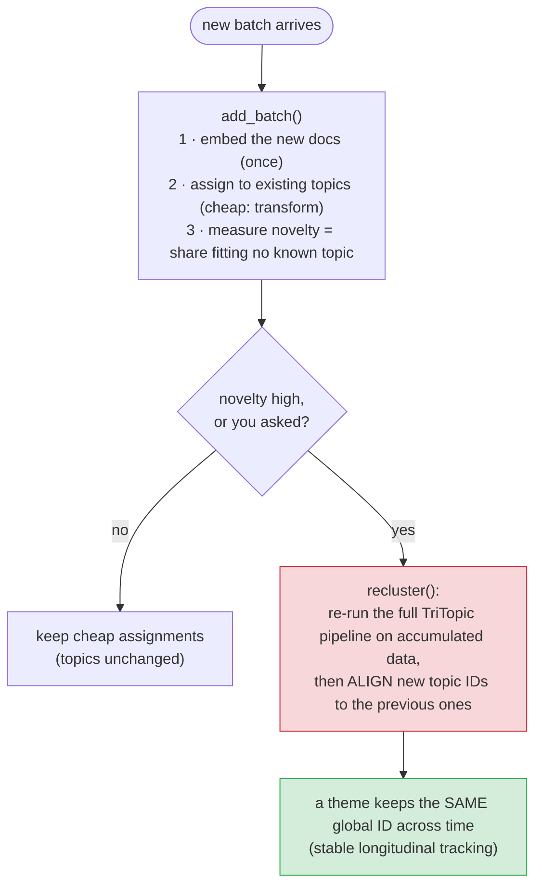
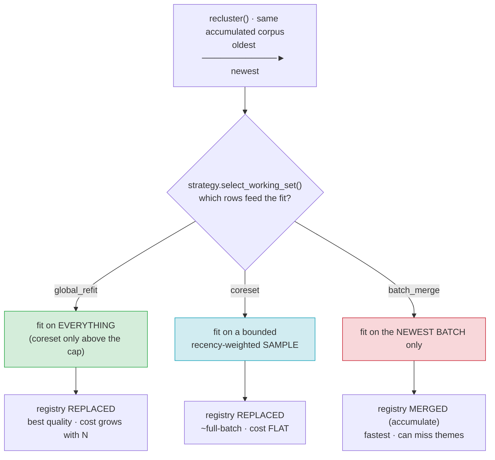
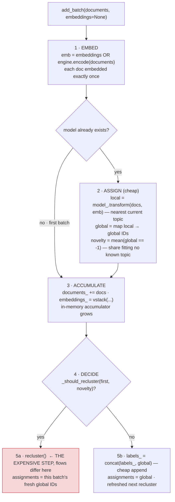
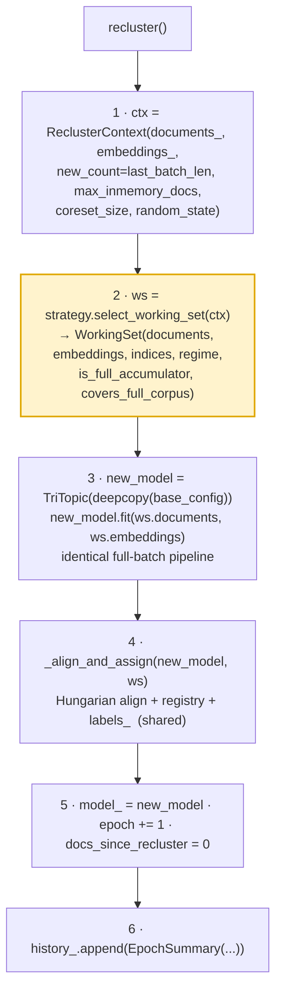
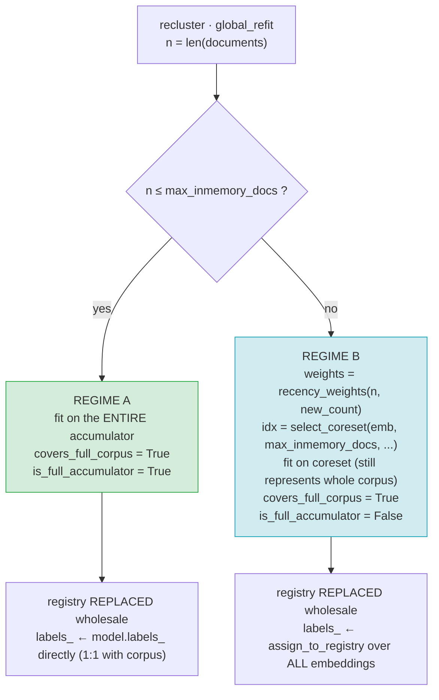
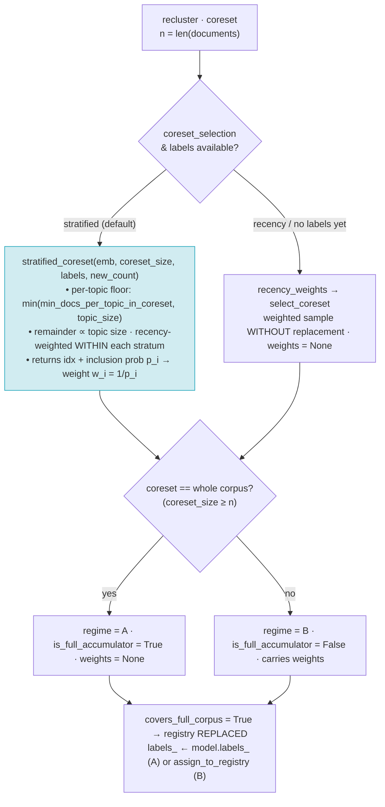
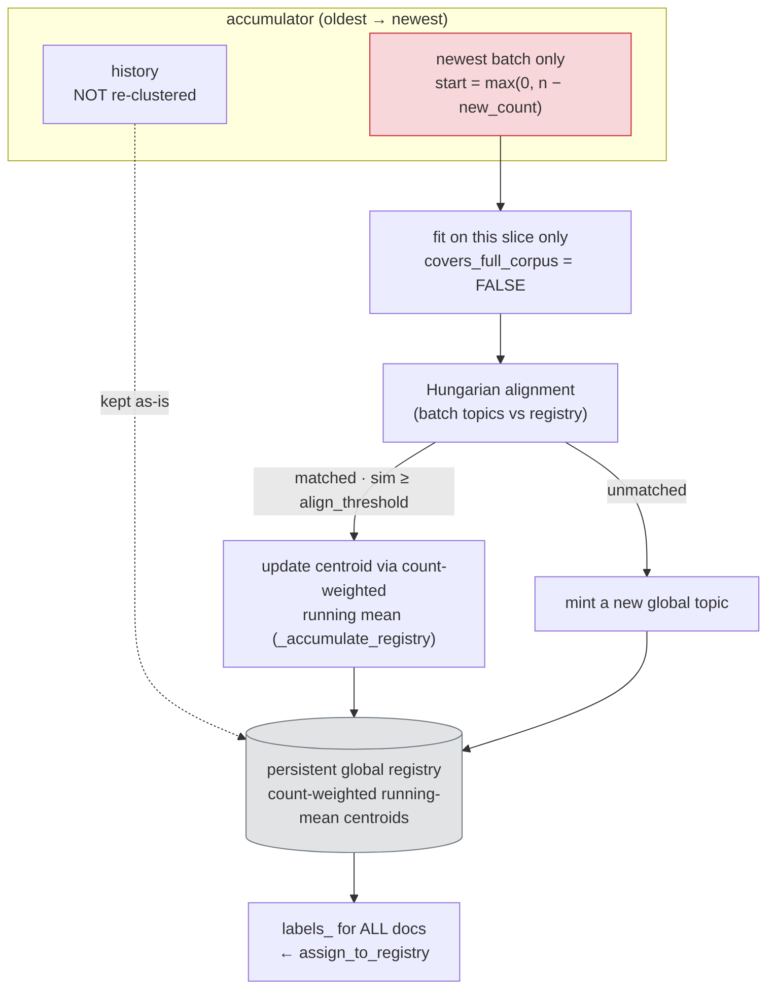
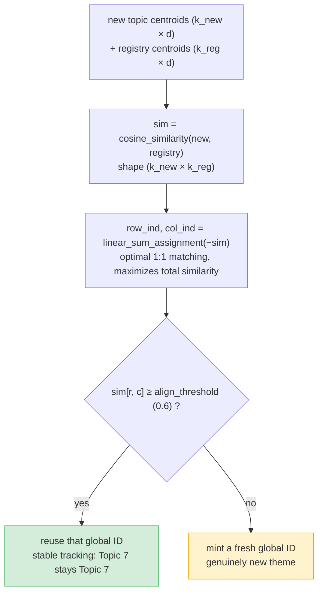

# Cumulative / Batch-wise Clustering for TriTopic

Cluster documents that **arrive in batches and accumulate over time** — and get a
single, high-level "bigger picture" of themes across *all* the data so far,
without re-thinking your whole pipeline.

This is a **separate, additive** layer on top of TriTopic. It **does not touch**
the existing full-batch `fit()` / `fit_transform()` — those behave exactly as
before. Everything here lives under `tritopic.cumulative`.

```python
from tritopic.cumulative import CumulativeTriTopic, CumulativeConfig

model = CumulativeTriTopic(CumulativeConfig(strategy="global_refit"))
model.add_batch(batch_1_docs)          # first batch -> clusters
model.add_batch(batch_2_docs)          # reclusters only if the data drifted
themes = model.bigger_picture(n_levels=3)   # high-level view across everything
print(model.get_topic_info())
```

---

## Table of contents
1. [When to use this](#when-to-use-this)
2. [How it works (mental model)](#how-it-works-mental-model)
3. [Install](#install)
4. [Quick start](#quick-start)
   - [Bring your own embeddings (recommended)](#a-bring-your-own-embeddings-recommended)
   - [Let it embed for you](#b-let-it-embed-for-you)
5. [The three flows (clustering strategies) — exact implementation](#the-three-flows-clustering-strategies--exact-implementation)
   - [Shared lifecycle: what every batch goes through](#shared-lifecycle-what-every-batch-goes-through)
   - [The shared recluster spine](#the-shared-recluster-spine)
   - [Flow 1 — `global_refit` (the gold standard)](#flow-1--global_refit-the-gold-standard)
   - [Flow 2 — `coreset` (bounded cost)](#flow-2--coreset-bounded-cost)
   - [Flow 3 — `batch_merge` (fastest)](#flow-3--batch_merge-fastest)
   - [Cross-cutting: topic alignment & the global registry](#cross-cutting-topic-alignment--the-global-registry)
6. [When does it recluster? (triggers)](#when-does-it-recluster-triggers)
7. [The "bigger picture" across all data](#the-bigger-picture-across-all-data)
8. [Scaling to millions of docs (Regime A → B)](#scaling-to-millions-of-docs-regime-a--b)
9. [Measuring quality vs full-batch](#measuring-quality-vs-full-batch)
10. [Real-world integration test (20 Newsgroups)](#real-world-integration-test-20-newsgroups)
11. [API reference](#api-reference)
12. [Configuration reference](#configuration-reference)
13. [FAQ & gotchas](#faq--gotchas)
14. [What's intentionally out of scope (DB phase)](#whats-intentionally-out-of-scope-db-phase)

---

## When to use this

Use **cumulative** clustering when:
- Documents come in **batches** (a few thousand to ~500k each), at **unpredictable**
  times, and **pile up** — total corpus grows into the millions.
- You want **themes across the accumulated corpus**, not isolated per-batch results.
- **Quality matters more than latency** and it's **not real-time**.

Use the original **full-batch** `TriTopic.fit(documents)` when you already have the
whole dataset in hand and just want to cluster it once. (Still fully supported.)

---

## How it works (mental model)



Two ideas do the heavy lifting:
- **Recluster only when needed.** Between reclusters, incoming batches are placed by
  cheap nearest-topic assignment. A full recluster (the expensive, gold-standard step)
  fires only when the data actually changes.
- **Stable global topic IDs.** Each recluster produces fresh IDs; we match them to the
  previous topics by centroid similarity (Hungarian assignment), so "Topic 7" stays
  "Topic 7" over time and genuinely-new themes get fresh IDs.

---

## Install

The cumulative layer adds **no new dependencies** — it reuses TriTopic's. For a
**model-free** setup (you supply embeddings; great for testing/benchmarks), you only
need the torch-free scientific stack:

```bash
pip install numpy pandas scipy scikit-learn igraph leidenalg joblib tqdm plotly
# or, from the repo:  pip install -e .
```

To embed text *inside* the library (path B below), also install an embedder:

```bash
pip install sentence-transformers        # local models
# or use the Google/API provider via TriTopicConfig(embedding_provider=...)
```

---

## Quick start

### A. Bring your own embeddings (recommended)

Embed once with whatever model you like, then pass vectors in. This is the
highest-quality, most efficient path (no re-embedding, no surprises).

```python
import numpy as np
from sentence_transformers import SentenceTransformer
from tritopic import TriTopicConfig
from tritopic.cumulative import CumulativeTriTopic, CumulativeConfig

encoder = SentenceTransformer("all-MiniLM-L6-v2")

cfg = CumulativeConfig(
    base_config=TriTopicConfig(verbose=False),  # all the usual TriTopic knobs
    strategy="global_refit",                     # default engine
    recluster_trigger="drift",                   # recluster when themes shift
    novelty_threshold=0.25,                       # 25% "doesn't fit" -> recluster
)
model = CumulativeTriTopic(cfg)

for batch_docs in stream_of_batches:             # your iterable of list[str]
    emb = encoder.encode(batch_docs, normalize_embeddings=True)
    result = model.add_batch(batch_docs, embeddings=emb)
    print(f"epoch={result.epoch} new={result.n_new_docs} "
          f"reclustered={result.reclustered} novelty={result.novelty}")

# Inspect the current state (covers ALL accumulated docs)
print(model.get_topic_info())          # per-topic keywords/sizes + GlobalTopic id
print("global topics:", model.n_global_topics)
labels = model.labels_                  # global topic id per accumulated doc (-1 = outlier)
```

### B. Let it embed for you

If you don't pass `embeddings=`, the model embeds with the engine configured in
`base_config` (defaults to `sentence-transformers` `all-MiniLM-L6-v2`):

```python
model = CumulativeTriTopic(CumulativeConfig())
model.add_batch(["doc one ...", "doc two ...", ...])   # embedded internally, once
```

> **No embedding model handy?** See `tritopic.cumulative.datasets.lsa_embed` and
> `make_streaming_corpus` for a model-free (TF-IDF + SVD) way to embed real text —
> used by the tests and the quality report.

---

## The three flows (clustering strategies) — exact implementation

Cumulative clustering ships **three interchangeable engines**, selected with one line:

```python
CumulativeConfig(strategy="global_refit")   # or "coreset" / "batch_merge"
```

They all expose the **same API** and produce the same kind of output (stable global
topic IDs over `labels_`). They differ in exactly **one decision**: *which documents
does the next recluster actually fit on?* Everything else — embedding, topic-ID
alignment, registry bookkeeping, full-corpus labelling — is **identical and shared**.

> **Mental model:** a "flow" = a `ReclusterStrategy` whose only job is to return a
> `WorkingSet` (the docs to fit on, plus four flags that tell the orchestrator how to
> book-keep). The strategy is a *pure selector*; it never clusters anything itself.
> See [`strategies.py`](strategies.py) and [`alignment.py`](alignment.py).

**30-second comparison:**

| `strategy` | Fits each recluster on… | Quality | Cost as corpus grows | Use when |
|---|---|---|---|---|
| `"global_refit"` *(default)* | **everything** accumulated (a coreset only above the cap) | **best — matches full-batch** | grows with N (bounded above the cap) | you want the best answer; corpus fits the in-memory budget |
| `"coreset"` | a bounded **stratified** sample (per-topic floor + recency within strata) | ~full-batch; **keeps rare topics** | **flat** | corpus too big to refit in RAM |
| `"batch_merge"` | only the **newest batch**, merged into the global set | good, but can miss themes; keywords drift | **flat & smallest** | speed beats completeness |

Approach **#3 (HNSW)** from the design is *not* a fourth flow — it runs *inside*
`fit()` automatically (`knn_backend="auto"`) for working sets above ~5k docs, so all
three flows get it for free. Head-to-head numbers:
[`LEARNING_GUIDE/CUMULATIVE_QUALITY_REPORT.md`](../../LEARNING_GUIDE/CUMULATIVE_QUALITY_REPORT.md).

**The one difference, side by side** — all three reach the same `recluster()`, then
diverge at a single decision: *which rows feed the fit?* (Each flow also gets its own
detailed diagram further down.)



### Shared lifecycle: what every batch goes through

Before the flows diverge, **every** `add_batch()` runs the same steps
([`cumulative.py:add_batch`](cumulative.py)):



Steps 1–4 are flow-agnostic. **The flow only matters at step 5a (`recluster()`).**

### The shared recluster spine

`recluster()` ([`cumulative.py:244`](cumulative.py#L244)) is the same for all three
flows. The strategy is consulted at exactly one line (`select_working_set`):



> Node **2** (highlighted) is the **only** step that differs between flows. Everything
> above and below it is identical.

A flow communicates its intent to the shared spine purely through the **four flags**
on the `WorkingSet` it returns:

| `WorkingSet` field | Meaning | Drives |
|---|---|---|
| `documents` / `embeddings` | the rows to fit the new `TriTopic` on | step 3 (`fit`) |
| `indices` | which accumulator rows were used (`None` = all) | bookkeeping |
| `regime` | `"A"` (full) or `"B"` (reduced) | reported in `history_` |
| `is_full_accumulator` | `True` ⇒ `model.labels_` already covers **every** accumulated doc | `labels_` source (direct vs `assign_to_registry`) |
| `covers_full_corpus` | `True` ⇒ these topics represent the whole corpus | registry update (**replace** vs **accumulate**) |

Keep those last two flags in mind — they're the entire reason the three flows behave
differently *after* fitting.

---

### Flow 1 — `global_refit` (the gold standard)

**Idea:** every recluster re-fits on the *entire* accumulated corpus, so the result is
**identical to running full-batch `TriTopic.fit()` on all data so far**. This is the
default and the quality ceiling. ([`GlobalRefitStrategy`](strategies.py#L71))



**Exact steps (`select_working_set`):**
1. `n = len(documents)`.
2. **Regime A** — if `n ≤ max_inmemory_docs`: return the whole accumulator unchanged,
   `regime="A"`, `is_full_accumulator=True`, `covers_full_corpus=True`, `weights=None`.
3. **Regime B** — otherwise: select a bounded coreset of `max_inmemory_docs` rows via the
   shared `_select_reduced` helper — **stratified by the current topic labels** by default
   (per-topic floor + inverse-propensity `weights`; see [Flow 2](#flow-2--coreset-bounded-cost)
   and [Representation weights](#representation-weights-weighted-coresets)), falling back to
   plain `recency_weights` + `select_coreset` when there are no labels yet (the first
   recluster) or `coreset_selection="recency"`. Returns those rows with `regime="B"`,
   `is_full_accumulator=False`, `covers_full_corpus=True`.

**What the shared spine then does:** fits a fresh `TriTopic`; because
`covers_full_corpus=True`, the registry is **replaced** wholesale by the new topics
(old topics are superseded — they were all re-derived). In Regime A, `labels_` come
directly from `model.labels_` (1:1 with the accumulator). In Regime B, `labels_` are
recomputed for *all* embeddings via nearest-centroid `assign_to_registry`.

**Cost:** scales with N up to the cap, then flat. **Quality:** best. Pick this unless
RAM/latency forces otherwise.

---

### Flow 2 — `coreset` (bounded cost)

**Idea:** *always* fit on a bounded representative sample of size `coreset_size`, no
matter how large the corpus is. Cost and memory stay **flat** forever, while quality
stays close to full-batch in tests. By default the sample is **stratified by the current
topic labels**, which guarantees small/rare topics a floor of representatives so they
survive the next refit (random/recency sampling drops them — "tail collapse").
([`CoresetStrategy`](strategies.py#L100))



**Exact steps (`select_working_set` → `_select_reduced`):**
1. **Stratified (default, `coreset_selection="stratified"`, labels present):**
   [`stratified_coreset`](alignment.py#L170) allocates each current topic a floor of
   `min(min_docs_per_topic_in_coreset, topic_size)` representatives first, splits the
   remaining budget proportional to topic size, and samples **within** each stratum by
   `recency_weights`. It returns sorted `idx` plus each point's inclusion probability
   `p_i = m_c/N_c`; the strategy turns that into an inverse-propensity **representation
   weight** `w_i = 1/p_i` (how many real docs the point stands for).
2. **Recency fallback** (`coreset_selection="recency"`, or the first recluster when no
   labels exist yet): `recency_weights(n, new_count)` — newest `new_count` docs get
   weight `1.0`, older docs ramp linearly from `floor=0.25` to `1.0`
   ([`recency_weights`](alignment.py#L126)) — then `select_coreset(...)` draws a weighted
   sample **without replacement** ([`select_coreset`](alignment.py#L143)); `weights=None`.
3. Return those rows. `covers_full_corpus=True` always; `is_full_accumulator=True` only
   when the coreset is the whole corpus (`regime="A"`, `weights=None`), else `"B"`.

**What the shared spine then does:** identical to Regime-B `global_refit` — the new
topics **replace** the registry, and `labels_` for the full accumulator are assigned by
nearest-centroid (`assign_to_registry`) since the model only saw a sample. When the
working set carries `weights`, they flow into the fit (weighted centroids, registry mass,
and c-TF-IDF — see [Representation weights](#representation-weights-weighted-coresets)).

**Cost:** flat (`O(coreset_size)`) regardless of N. **Quality:** ~full-batch in tests,
with markedly better **rare-topic recall** than recency sampling. **Difference from
`global_refit` Regime B:** `coreset` is bounded by `coreset_size` *always*; `global_refit`
only switches to a (larger, `max_inmemory_docs`) coreset once it overflows the cap.

---

### Flow 3 — `batch_merge` (fastest)

**Idea:** never re-touch history. Cluster **only the newest batch**, then *merge* its
topics into the persistent global registry via centroid alignment. Cheapest possible
recluster. ([`BatchMergeStrategy`](strategies.py#L120))



**Exact steps (`select_working_set`):**
1. `start = max(0, n - new_count)`; `idx = arange(start, n)` — just the tail.
2. Return `documents[start:]`, `embeddings[start:]`.
   `covers_full_corpus=False` (**the key difference** — batch topics do **not** replace
   the global set), `is_full_accumulator = (start == 0)` (only true on the very first
   batch), `regime="A"` if `start==0` else `"B"`.

**What the shared spine then does (the merge):** because `covers_full_corpus=False`,
the orchestrator calls `_accumulate_registry` instead of replacing. For each new batch
topic, alignment decides whether it matches an existing global topic:
- **Matched** global topic → its registry centroid is updated by a **count-weighted
  running mean**: `merged = (old_centroid·old_count + new_centroid·new_size) / (old_count + new_size)`,
  then re-normalized ([`_accumulate_registry`](cumulative.py#L872)).
- **Unmatched** → minted as a brand-new global topic.

`labels_` for the full accumulator are then recomputed via `assign_to_registry` against
the merged registry.

**Cost:** flat and smallest (only ever fits `new_count` docs). **Caveats** (documented
and warned in code): a theme **absent from the newest batch can be missed**, and
per-topic **keywords are computed from one batch**, so they drift. The visualizers warn
about this (`visualize_topics`/`visualize_hierarchy`/`visualize_topic_map` show the last
batch's topics only). Use `global_refit`/`coreset` when completeness matters.

---

### Cross-cutting: topic alignment & the global registry

This machinery is **shared by all three flows** and is what makes "Topic 7 stays Topic
7 across time" true. It lives in [`alignment.py`](alignment.py) and
`_align_and_assign` ([`cumulative.py:809`](cumulative.py#L809)).

**1. Hungarian alignment** ([`align_topics`](alignment.py#L28)). After a fresh fit, the
new model's topic IDs are arbitrary. We match the new topic centroids to the persistent
registry centroids:



Worked example — the cosine-similarity matrix the Hungarian step optimizes over:

```text
              registry topics (old global IDs)
                g0      g1      g2      g3
  new   n0 [  0.91    0.10    0.22    0.05 ]   → matched g0 (0.91 ≥ 0.6)  → reuse g0
  topics n1 [  0.08    0.88    0.15    0.30 ]   → matched g1 (0.88 ≥ 0.6)  → reuse g1
         n2 [  0.12    0.20    0.18    0.21 ]   → best 0.21 < 0.6          → mint g4 (new theme)
```

- First epoch (empty registry): new topics just get sequential IDs `0,1,2,…`.
- `align_threshold` (default `0.6`) is the cosine floor for "same theme". Lower it to
  merge more aggressively; raise it to split more readily.
- If `align_topics=False`, alignment is skipped and every epoch mints sequential IDs
  (`identity_mapping`) — useful for debugging, but IDs are not stable across epochs.

**2. Registry update — replace vs. accumulate.** This is the fork driven by
`covers_full_corpus`:

| Flow / regime | `covers_full_corpus` | Registry update |
|---|---|---|
| `global_refit` (A & B), `coreset` | `True` | **`_replace_registry`** — registry := exactly the new topics (history was re-clustered, old topics superseded) |
| `batch_merge` | `False` | **`_accumulate_registry`** — count-weighted running-mean merge of batch topics into the persistent registry; unmatched → new global IDs |

**3. Full-corpus labelling.** Driven by `is_full_accumulator`:
- `True` (only `global_refit` Regime A, or a `coreset` that covered everything):
  `labels_` are mapped **directly** from `model.labels_` (already 1:1 with every doc).
- `False` (every other case): `labels_` for **all** accumulated embeddings are computed
  by nearest-centroid against the registry via
  [`assign_to_registry`](alignment.py#L100); docs whose best cosine match is below
  `base_config.outlier_threshold` are labelled `-1`.

The net guarantee, for **all three flows**: after any `add_batch`, `labels_` holds a
stable global topic ID (or `-1`) for **every document ever added**.

> **Regime B history summarization.** `alignment.py` also ships
> [`summarize_embeddings`](alignment.py#L255) (CluStream/BIRCH-style MiniBatchKMeans
> micro-cluster centroids + counts) so old themes can survive as compact weighted
> summaries instead of being windowed away. It's the building block for folding history
> under the cap.

### Representation weights (weighted coresets)

A coreset point should not count as one document — it **stands in for many**. When a
reduced working set is stratified-sampled, each selected row carries a **representation
weight** `w_i = 1/p_i` (its stratum's inverse inclusion probability — a Horvitz–Thompson
design weight). These weights ride on `WorkingSet.weights` and are threaded through the
fit so the model reflects true corpus mass rather than sample counts:

| Where | Unweighted (old) | Weighted (`sample_weights` present) |
|---|---|---|
| **Topic centroids** ([`_compute_topic_centroids`](../core/model.py#L1005)) | plain mean of member embeddings | `np.average(..., weights=w)` — a point worth 10k docs pulls the centroid accordingly |
| **Registry mass** ([`_align_and_assign`](cumulative.py#L809)) | raw `topic.size` (sample count) | sum of member weights → drives `_replace`/`_accumulate_registry` running means |
| **c-TF-IDF keywords** ([`_extract_ctfidf`](../core/keywords.py#L106)) | concatenate topic docs | per-doc term counts scaled by weight, so heavy points dominate proportionally |

`TriTopic.fit(..., sample_weights=None)` (the default everywhere else) reproduces the old
unweighted behaviour exactly — the full-batch path is untouched. Weights are only produced
by the **stratified** coreset path; the kNN graph itself stays node-unweighted (the
per-topic floor already guarantees small topics enough nodes to clear `min_cluster_size`).

---

## When does it recluster? (triggers)

Set with `CumulativeConfig(recluster_trigger=...)`. The **first** batch always
clusters. After that:

| `recluster_trigger` | Fires a recluster when… | Key knobs |
|---|---|---|
| `"drift"` *(default)* | the batch's **novelty** (share of docs that fit no known topic) exceeds `novelty_threshold` | `novelty_threshold` (default 0.30) |
| `"schedule"` | `schedule_every_n_docs` docs have accumulated since the last recluster | `schedule_every_n_docs` |
| `"manual"` | never automatically — **you** call `model.recluster()` | — |

`min_docs_between_recluster` debounces auto-triggers (avoid reclustering too often).
You can always force one with `model.recluster()` regardless of the trigger.

```python
# Drift-based (adaptive): recluster only when the data changes
CumulativeConfig(recluster_trigger="drift", novelty_threshold=0.25)

# Scheduled (predictable cost): every 50k new docs
CumulativeConfig(recluster_trigger="schedule", schedule_every_n_docs=50_000)

# Manual: you decide
cfg = CumulativeConfig(recluster_trigger="manual")
...
model.add_batch(docs, embeddings=emb)
model.recluster()        # when you want it
```

---

## The "bigger picture" across all data

After any number of batches, get the high-level view. This reuses TriTopic's existing
machinery and **scales with the number of topics, not the number of documents**.

```python
view = model.bigger_picture(n_levels=3)
hierarchy = view["hierarchy"]            # TopicHierarchy: coarse -> fine themes
for node in hierarchy.cut(0):            # coarsest level = the big themes
    print(node.node_id, node.keywords[:5], "size:", node.size)
```

Add an LLM labeler to also get human-readable **meta-themes** (report-style):

```python
from tritopic import LLMLabeler
labeler = LLMLabeler(provider="anthropic", api_key="...")

view = model.bigger_picture(labeler=labeler, n_levels=3, n_themes=8)
for theme in view["themes"]:             # list[ReportTheme]
    print(theme.title, "->", theme.topic_ids)
```

---

## Scaling to millions of docs (Regime A → B)

A single max-size batch (~500k docs × 768-dim) is already ~1.5 GB of embeddings, and
the corpus only grows. The system handles this with two regimes, switched on the
working-set size (`max_inmemory_docs`):

- **Regime A** — corpus ≤ `max_inmemory_docs`: refit on **everything** (gold-standard).
- **Regime B** — corpus > `max_inmemory_docs`: refit on a **bounded recency-weighted
  coreset / micro-cluster summary** of history, so **cost and memory stay ~flat** no
  matter how much data accumulates. Old themes survive as summaries (not windowed away).

```python
CumulativeConfig(
    strategy="global_refit",     # transparently uses a coreset above the cap
    max_inmemory_docs=300_000,   # the absolute working-set cap
    coreset_size=50_000,         # summary size in Regime B
)
```

`model.history_[-1].regime` tells you which regime the last recluster used (`"A"`/`"B"`).

---

## Measuring quality vs full-batch

The full-batch `fit()` on all accumulated docs is the **quality ceiling**. Compare
against it directly:

```python
import copy
from tritopic import TriTopic, TriTopicConfig
from tritopic.cumulative.evaluation import compare_to_full_batch, benchmark_strategies

# One model vs the baseline (same docs, same order):
full = TriTopic(config=copy.deepcopy(base_cfg)); full.fit(all_docs, embeddings=all_emb)
metrics = compare_to_full_batch(model, full, labels_true=optional_ground_truth)
#  -> ari_vs_full, nmi_vs_full, topic_count_drift, keyword_overlap,
#     silhouette_*, rare_topic_recall, ari_vs_truth_* (if labels given), ...
#  rare_frac / rare_sim_cutoff tune which full-batch topics count as "rare".

# All engines, head-to-head, same batch stream:
df = benchmark_strategies(
    batches,                          # list[list[str]]
    base_config=base_cfg,
    labels_true=ground_truth,         # optional
    precomputed_batch_embeddings=batch_embs,   # optional (skip embedding)
)
print(df)                             # one row per strategy
```

Run the ready-made synthetic report (no model download):

```bash
python benchmarks/cumulative_quality_report.py
```

Metric cheat-sheet (full glossary in the quality report):

| Metric | Plain meaning | Good |
|---|---|---|
| `ari_vs_full` / `nmi_vs_full` | same grouping as re-running on all data? | → 1.0 |
| `ari_vs_truth_*` | recovered the *real* topics? | higher |
| `topic_count_drift` | difference in #topics vs full-batch | → 0 |
| `keyword_overlap` | matched topics described by the same words? | → 1.0 |
| `silhouette_*` | clusters tight & well-separated? | higher |
| `rare_topic_recall` | share of the full-batch's **small** topics the model still recovers (tail-collapse) | → 1.0 |
| `novelty` (per batch) | share of new docs fitting no topic (drift signal) | low = stable |

> `coreset_cost_ratio(working_emb, working_weights, full_emb, k)` is a separate,
> theory-aligned helper: weighted k-means distortion on the working set ÷ on the full
> data (≈ 1.0 = a faithful coreset). Call it when you have a strategy's working set in
> hand — it's intentionally not part of the multi-strategy `benchmark_strategies` table.

---

## Real-world integration test (20 Newsgroups)

A full integration test against the **20 Newsgroups** dataset (18,846 real docs,
20 labeled categories) exercises every flow — drift detection, all 3 strategies,
the hierarchy, and `evaluate()` — with a real `all-MiniLM-L6-v2` embedding model.

**Install the embedding model once** (~1-2 GB download):

```bash
# from the repo root
uv pip install sentence-transformers
# or:  pip install "tritopic[integration]"
```

**Run the full integration test script** (first run encodes 18k docs on CPU — ~30-40 min
without a GPU; subsequent runs load cached embeddings and finish in ~5-10 min):

```bash
python benchmarks/integration_test_20ng.py
```

The first run caches embeddings to `benchmarks/.cache/`. What it validates:
- **Drift detection** — batches 1-4 contain 15 categories; batches 5-6 introduce 5
  new categories → novelty spikes → recluster fires → new topics discovered.
- **Strategy comparison** — `global_refit` vs `coreset` vs `batch_merge` on real text.
- **Bigger picture** — 3-level hierarchy on 18k docs with real embeddings.
- **Memory** — `low_memory=True` avoids the 18k×18k dense matrix (~2.7 GB).

**Run the lightweight pytest version** (real 20NG text, LSA embeddings, no torch, ~15 s):

```bash
pytest tests/test_integration_20ng.py -v -m "not slow"
```

**Run the HNSW path test** (6k docs, sentence-transformers or LSA, ~2 min):

```bash
pytest tests/test_integration_20ng.py -v -m slow
```

---

## API reference

### `CumulativeTriTopic(config: CumulativeConfig | None = None)`

| Method | Description |
|---|---|
| `add_batch(documents, embeddings=None, metadata=None) -> BatchResult` | Ingest a batch, assign it, recluster if the trigger fires. |
| `recluster() -> self` | Force a recluster of the accumulated corpus + re-align topic IDs. |
| `transform(documents, embeddings=None) -> np.ndarray` | Assign **new** docs to **global** topic IDs (does not accumulate them). |
| `transform_proba(documents, embeddings=None) -> np.ndarray` | Soft assignment over the current model's topics. |
| `bigger_picture(labeler=None, n_levels=3, n_themes=None) -> dict` | `{"hierarchy": TopicHierarchy, "themes": list[ReportTheme] \| None}`. |
| `get_topic_info(global_ids=True) -> pd.DataFrame` | Per-topic table (`Topic`, `Size`, `Keywords`, …) + a `GlobalTopic` column. |
| `evaluate() -> dict` | Coherence/diversity/stability of the current model + cumulative bookkeeping. |

| Property | Meaning |
|---|---|
| `labels_` | Global topic ID for **every accumulated doc** (`-1` = outlier). |
| `model_` | The most recent fitted `TriTopic` (used for keywords/hierarchy/themes). |
| `n_global_topics` | Number of stable global topics. |
| `epoch` | How many reclusters have happened. |
| `history_` | `list[EpochSummary]` — one entry per recluster. |
| `documents_` / `embeddings_` | The accumulated corpus (read-only). |

### `BatchResult`
`epoch`, `n_new_docs`, `n_total_docs`, `reclustered` (bool), `novelty` (float | None,
`None` on the first batch), `assignments` (global IDs for this batch's docs).

### `EpochSummary`
`epoch`, `strategy`, `regime` (`"A"`/`"B"`), `n_docs_clustered`, `n_total_docs`,
`n_topics`, `n_global_topics`.

### Evaluation & data helpers
`tritopic.cumulative.evaluation`: `compare_to_full_batch(...)`, `benchmark_strategies(...)`.
`tritopic.cumulative.datasets`: `make_streaming_corpus(...)`, `lsa_embed(...)`,
`StreamingCorpus`.

---

## Configuration reference

`CumulativeConfig` fields:

| Field | Default | What it does |
|---|---|---|
| `base_config` | `None` → `TriTopicConfig()` | The full-batch config reused for every recluster (graph type, consensus, HNSW backend, dim-reduction, embedder, …). |
| `strategy` | `"global_refit"` | Clustering engine: `global_refit` / `coreset` / `batch_merge`. |
| `recluster_trigger` | `"drift"` | `drift` / `schedule` / `manual`. |
| `novelty_threshold` | `0.30` | Drift trigger: outlier share above this → recluster. |
| `min_docs_between_recluster` | `0` | Debounce auto-triggers. |
| `schedule_every_n_docs` | `None` | For `schedule` trigger. |
| `max_inmemory_docs` | `300_000` | Working-set cap; above it → Regime B (summarized). |
| `coreset_size` | `50_000` | Size of the Regime-B coreset/summary. |
| `coreset_selection` | `"stratified"` | How reduced working sets are sampled: `stratified` (per-topic floor + representation weights; keeps rare topics) or `recency` (legacy recency-weighted random). |
| `min_docs_per_topic_in_coreset` | `50` | Stratified per-topic floor — every current topic is guaranteed at least this many representatives (or its full size) in the coreset. |
| `align_topics` | `True` | Keep stable global topic IDs across epochs (Hungarian alignment). |
| `align_threshold` | `0.6` | Cosine below which a new topic is treated as genuinely new. |
| `verbose` | `False` | Print per-batch progress. |

---

## FAQ & gotchas

**Do topic IDs stay stable over time?** Yes — with `align_topics=True` (default), a
theme keeps the same global ID across reclusters; new themes get fresh IDs. Lower
`align_threshold` to merge more aggressively, raise it to split more readily.

**Does `labels_` always cover every doc?** Yes. At a recluster it's recomputed for the
whole corpus; between reclusters, new batches are appended using cheap transform-based
assignment (refreshed at the next recluster).

**Why didn't a rare new topic trigger a recluster?** If a new theme trickles in slowly,
its novelty may stay below `novelty_threshold`. Lower the threshold, or add a
`schedule` safety-net recluster. (This exact tradeoff is shown in the quality report.)

**`batch_merge` found fewer topics / odd keywords?** Expected — it only clusters the
newest batch, so themes absent from that batch can be missed and per-topic keywords are
computed from one batch. Use `global_refit`/`coreset` when completeness matters.

**Does this change the existing `fit()`?** No. The full-batch path in
`tritopic/core/model.py` is untouched; this is a separate package.

**Multi-view / metadata?** `add_batch(metadata=...)` is accepted for API symmetry but
the metadata view isn't wired into cumulative reclustering yet (future work).

---

## What's intentionally out of scope (DB phase)

This is an **in-memory POC**. Deliberately deferred to a later "DB phase":
- Persisting the accumulator / topic registry / HNSW index to disk (surviving a
  process, exceeding RAM).
- A real document/embedding store.
- Global c-TF-IDF over retained raw text across batches.

These don't affect the clustering logic here — they're about durability and scale
beyond a single process.
